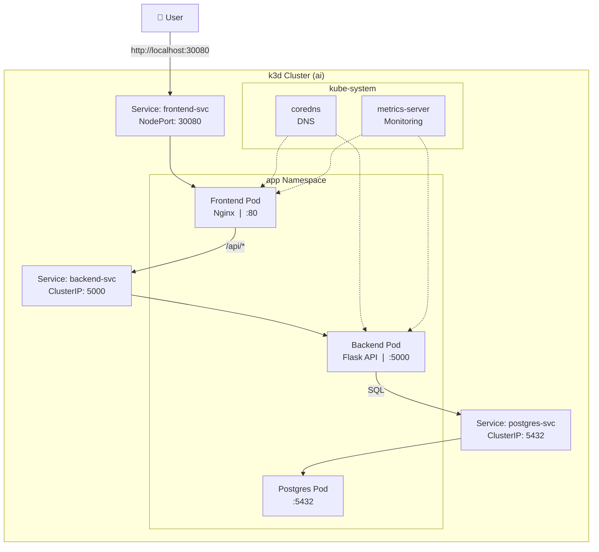

# Kubernetes Microservice Lab 🚢

A hands-on educational lab for learning Kubernetes by deploying a real microservice application on a local k3d cluster.

## Architecture



## Stack

| Component | Technology | Port | Image |
|-----------|-----------|------|-------|
| Frontend | Nginx + HTML/JS | 80 | `nginx:alpine` |
| Backend | Python Flask | 5000 | Custom (Alpine) |
| Database | PostgreSQL | 5432 | `postgres:18-alpine` |
| Orchestration | k3d (K3s in Docker) | — | v1.31.5 |
| Monitoring | k9s + metrics-server | — | CLI + cluster |

## Cluster Resources

| Node | Role | CPU | RAM |
|------|------|-----|-----|
| k3d-ai-server-0 | control-plane | 2.5GHz | ~300MB |
| k3d-ai-agent-0 | worker | 2.5GHz | ~130MB |

## Quick Start

```bash
# 1. Ensure cluster is running
k3d cluster list

# 2. Deploy the app
kubectl apply -f manifests/

# 3. Check status
kubectl get all -n app

# 4. Access the app
curl http://localhost:30080

# 5. Monitor with k9s
k9s
```

## Tutorials

1. [Cluster Setup](tutorial/01-cluster-setup.md)
2. [Deploy Database](tutorial/02-deploy-database.md)
3. [Deploy Backend](tutorial/03-deploy-backend.md)
4. [Deploy Frontend](tutorial/04-deploy-frontend.md)

## Requirements

- Docker + k3d
- kubectl
- 400MB free RAM for the app (800MB total with cluster)

## License

MIT — Educational use. Deploy, modify, learn!
