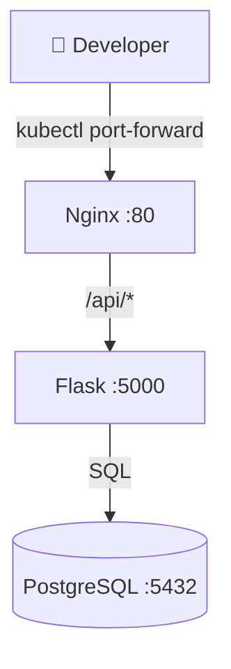

# 🚢 Building a Kubernetes Microservice Lab from Scratch (on 11GB RAM)

**Published on [Fullstack DevLog](https://fullstack-devlog.pages.dev)**

> Deploy a real 3-tier app on k3d, debug real production problems, and learn Kubernetes by building — not watching.

---

I wanted to learn Kubernetes properly. Not "watch a course" properly. Not "read the docs" properly. **Actually deploy things and break them** properly.

The problem: my laptop has an i7-6500U and 11GB of RAM. Not exactly a datacenter.

The solution: **k3d** — Kubernetes in Docker, optimized for local dev. With some aggressive tuning, I got a full 2-node cluster running at ~450MB.

Here's everything I built, broke, and learned.

---

## The Stack

| Layer | Tech | Why |
|-------|------|-----|
| Orchestration | k3d (K3s in Docker) | Lightweight, 2 nodes, 450MB total |
| Frontend | Nginx Alpine | Reverse proxy, static HTML |
| Backend | Python Flask | REST API, connects to DB |
| Database | PostgreSQL 16 | Real SQL, real persistence |
| Monitoring | k9s + metrics-server | Terminal UI, `kubectl top` |

## Architecture



[Interactive diagram →](https://github.com/julio-arcila/k8s-microservice-lab/blob/master/diagrams/architecture.mmd)

## The Cluster Setup

```bash
k3d cluster create ai \
  --servers 1 \
  --agents 1 \
  --k3s-arg "--disable=traefik,metrics-server,local-storage,servicelb" \
  --k3s-arg "--bind-address=0.0.0.0@server:*"
```

**Key flags:**
- `--disable=traefik,...` — saves ~200MB by removing unused services
- `--bind-address=0.0.0.0` — allows worker nodes to join the cluster
- `--agents 1` — adds a worker for realistic pod scheduling

**Result:** 2 nodes (1 master + 1 worker), ~450MB total, ready in 22 seconds.

## Real Bugs I Hit (And Fixed)

### 1. Worker Nodes Can't Join
**Symptom:** `connection refused` on `localhost:8080`
**Root cause:** k3s API server only bound to `127.0.0.1` by default
**Fix:** `--bind-address=0.0.0.0` — now the worker can reach the server at `172.18.0.2:6443`

### 2. postgres:18-alpine Crashes on Startup
**Symptom:** Container exits with "data directory" error
**Root cause:** PostgreSQL 18 changed the mount layout — expects a subdirectory
**Fix:** Downgrade to `postgres:16-alpine` for Docker compatibility

### 3. Nginx Crashes When Backend Isn't Ready
**Symptom:** `host not found in upstream "backend-svc"`
**Root cause:** Nginx resolves upstream hosts at **startup**, not at request time
**Fix:** Runtime DNS resolution:
```nginx
resolver kube-dns.kube-system.svc.cluster.local valid=5s;
location /api/ {
    set $backend "backend-svc.app.svc.cluster.local:5000";
    proxy_pass http://$backend;
}
```
This is a **production pattern** — your nginx should never crash just because a backend is down.

### 4. Manually Edited CoreDNS → Broken RBAC
**Symptom:** `SERVFAIL` on all service lookups
**Root cause:** Manual coredns deployment used wrong service account
**Fix:** Always let k3s manage coredns — it ships proper RBAC in `/var/lib/rancher/k3s/server/manifests/`

### 5. PersistentVolumes Without a Provisioner
**Symptom:** PVC stuck in `Pending` forever
**Root cause:** k3d has no default storage class
**Fix:** Use `emptyDir` for learning labs, or manually create hostPath PVs with node affinity

## Deploy It Yourself

```bash
git clone https://github.com/julio-arcila/k8s-microservice-lab
cd k8s-microservice-lab
kubectl apply -f manifests/
kubectl port-forward -n app svc/frontend-svc 8080:80
# Open http://localhost:8080
```

## What I Learned

1. **k3d is production-grade** — it's not "toy Kubernetes". RBAC, DNS, scheduling, networking all work like real k8s.
2. **Resource tuning matters** — on 11GB RAM, you can run a real microservice stack if you're deliberate about what you disable.
3. **DNS is the silent killer** — most connectivity issues in k8s come down to DNS misconfiguration.
4. **ConfigMaps are underrated** — you can deploy entire apps without building Docker images.
5. **Debug logs > assumptions** — every fix above came from `kubectl logs`, not guessing.

---

**Repository:** [github.com/julio-arcila/k8s-microservice-lab](https://github.com/julio-arcila/k8s-microservice-lab)
**Fullstack DevLog:** [fullstack-devlog.pages.dev](https://fullstack-devlog.pages.dev)

*Built with [OpenClaw](https://openclaw.ai) + k3d + Cloudflare Pages*
