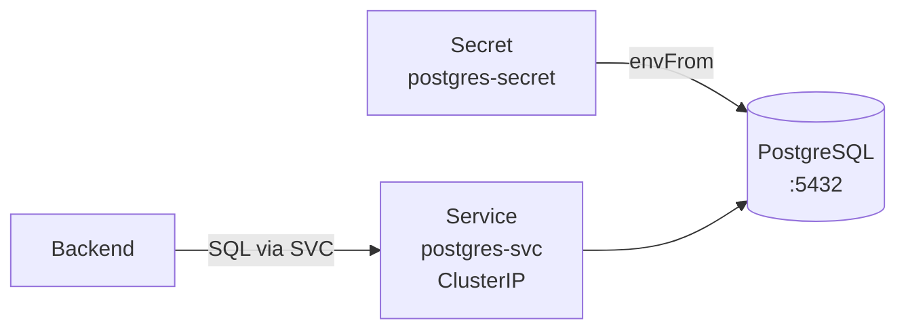

# 02 — Deploy PostgreSQL

## Goal
Deploy a PostgreSQL database on Kubernetes with proper configuration.

## Architecture



## Key Concepts

- **Secrets** — Store sensitive credentials (passwords, tokens)
- **ClusterIP Service** — Internal-only network endpoint
- **Pod resource limits** — Prevent noisy neighbors

## Manifest Walkthrough

### Secret
```yaml
apiVersion: v1
kind: Secret
metadata:
  name: postgres-secret
type: Opaque
stringData:
  POSTGRES_USER: admin
  POSTGRES_PASSWORD: secret123
  POSTGRES_DB: tasks
```

### Deployment
```yaml
apiVersion: apps/v1
kind: Deployment
metadata:
  name: postgres
spec:
  replicas: 1
  selector:
    matchLabels:
      app: postgres
  template:
    spec:
      containers:
      - name: postgres
        image: postgres:16-alpine  # 16 is more Docker-friendly than 18
        envFrom:
        - secretRef:
            name: postgres-secret
        resources:
          requests: {memory: "128Mi", cpu: "250m"}
          limits:   {memory: "256Mi", cpu: "500m"}
```

### Service
```yaml
apiVersion: v1
kind: Service
metadata:
  name: postgres-svc
spec:
  selector:
    app: postgres
  ports:
  - port: 5432
    targetPort: 5432
```

## Deploy
```bash
kubectl apply -f manifests/
kubectl get pods -n app -l app=postgres
```

## Lessons Learned

1. **postgres:18-alpine** changed the data directory layout — use `postgres:16-alpine` for Docker
2. **PersistentVolumes** need a provisioner in k3d — use `emptyDir` or set up a local-path provisioner
3. **Always use Secrets** — never hardcode credentials in Deployment specs
4. The PVC must be created BEFORE the Deployment references it
