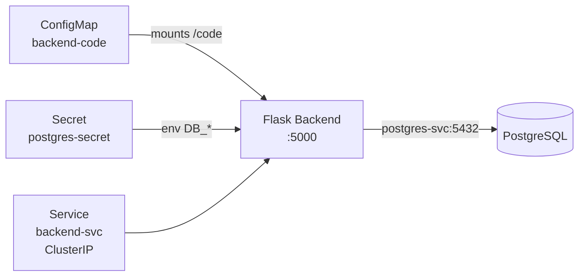

# 03 — Deploy Backend API

## Goal
Deploy a Python Flask API that connects to PostgreSQL using Kubernetes-native service discovery.

## Architecture



## Key Concepts

- **ConfigMap** — Store non-sensitive configuration and code
- **Init Containers** — Run setup before main container starts
- **Readiness Probes** — Tell k8s when the pod is ready for traffic
- **Service Discovery** — Pods find each other via DNS: `<service>.<namespace>.svc.cluster.local`

## Manifest Walkthrough

### ConfigMap (application code)
```yaml
apiVersion: v1
kind: ConfigMap
metadata:
  name: backend-code
data:
  app.py: |
    from flask import Flask, jsonify, request
    import psycopg2, os
    # ... full Flask app
```

### Deployment
```yaml
spec:
  containers:
  - name: backend
    image: python:3.12-alpine
    command: ["sh", "-c", "pip install flask psycopg2-binary -q && python /code/app.py"]
    env:
    - name: DB_HOST
      value: "postgres-svc.app.svc.cluster.local"  # Full DNS name
    - name: DB_USER
      valueFrom:
        secretKeyRef: {name: postgres-secret, key: POSTGRES_USER}
    readinessProbe:
      httpGet:
        path: /health
        port: 5000
      initialDelaySeconds: 15
      periodSeconds: 5
```

**Why full DNS name?** `postgres-svc.app.svc.cluster.local` works across namespaces. In the same namespace, `postgres-svc` is enough — but the FQDN is more explicit and avoids ambiguity.

## Deploy
```bash
kubectl apply -f manifests/03-backend.yaml
kubectl logs -n app deploy/backend --tail=10
```

## Lessons Learned
1. **Pip needs internet** — pods inside k3d need working DNS + outbound network. If pip can't download packages, use a pre-built image or host network
2. **Readiness probes are essential** — the pod shouldn't receive traffic until Flask is actually serving
3. **ConfigMap size limits** — max 1MB. For larger codebases, build a Docker image
4. **Use `svc.cluster.local`** — the FQDN format avoids DNS ambiguity between namespaces
