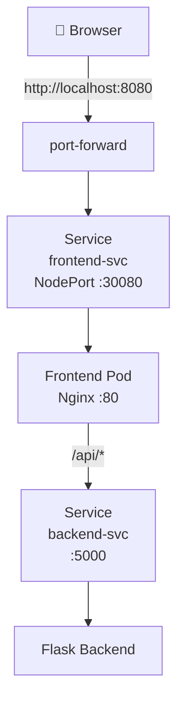

# 04 — Deploy Frontend + Expose the App

## Goal
Deploy an Nginx frontend that proxies API calls to the backend and serves a static HTML page, then expose it via NodePort.

## Architecture



## Key Concepts

- **ConfigMap for Nginx config** — Mount nginx.conf without building a custom image
- **nginx resolver** — Use runtime DNS resolution so nginx doesn't crash if the backend isn't ready yet
- **NodePort** — Expose a service on a fixed port across all nodes
- **Reverse proxy** — Frontend routes `/api/*` to the backend service

## Nginx Config (critical fix!)

```nginx
# Use runtime DNS resolution — avoids startup crash if backend isn't ready
resolver kube-dns.kube-system.svc.cluster.local valid=5s;

server {
    listen 80;
    root /usr/share/nginx/html;

    location /api/ {
        set $backend "backend-svc.app.svc.cluster.local:5000";
        proxy_pass http://$backend;
    }
}
```

**Without `resolver` + variable:** Nginx tries to resolve `backend-svc` at startup. If the service doesn't exist yet → nginx crashes. With the variable approach, it resolves at request time.

## Manifest Walkthrough

Two ConfigMaps:
1. `frontend-config` — nginx.conf
2. `frontend-html` — index.html with the Task Manager UI

```yaml
volumes:
- name: nginx-config
  configMap:
    name: frontend-config
- name: html
  configMap:
    name: frontend-html
```

## Access the App

Since k3d runs in Docker, NodePort isn't directly reachable. Use port-forward instead:

```bash
# Option A: port-forward
kubectl port-forward -n app svc/frontend-svc 8080:80

# Option B: access via k3d load balancer IP + NodePort
# (requires checking docker port mappings)
docker port k3d-ai-serverlb
```

Then open `http://localhost:8080`

## Lessons Learned

1. **Nginx + Kubernetes DNS** — use `resolver` with runtime variables. Static `proxy_pass` with hostnames crashes at startup
2. **k3d networking** — NodePort services require port-forward or special k3d config. For production, use an Ingress
3. **ConfigMaps can hold ANY text** — HTML, nginx config, Python code. Makes development fast (no Docker build!)
4. **CORS is not needed** — the frontend and backend are on the same origin because nginx proxies `/api/` requests
