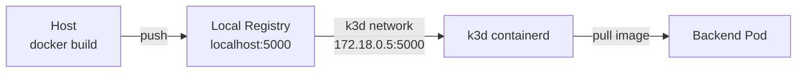

# 05 — Local Docker Registry

## Goal
Set up a local Docker registry for building and pushing custom images without Docker Hub.

## Architecture



## Key Concepts

- **Private registry** — No need for Docker Hub; images stay local
- **Insecure registry** — HTTP (not HTTPS) for local dev
- **containerd mirrors** — k3s uses containerd, which needs explicit registry config
- **Image tags** — `localhost:5000/app:v1` for host, `172.18.0.5:5000/app:v1` inside k3d

## Step 1: Create the Registry

```bash
k3d registry create lab-registry.localhost --port 5000
```

## Step 2: Connect to k3d Network

```bash
# Connect registry container to the k3d cluster's Docker network
docker network connect k3d-ai k3d-lab-registry.localhost

# Get the registry's IP on the k3d network
REGISTRY_IP=$(docker inspect k3d-lab-registry.localhost \
  --format '{{range .NetworkSettings.Networks}}{{if ne .IPAddress ""}}{{println .IPAddress}}{{end}}{{end}}' \
  | grep "172.18" | head -1)
```

## Step 3: Configure containerd Mirrors

k3s uses containerd — you must tell it about the registry:

```bash
# On the k3d server node
cat > /tmp/registries.yaml << EOF
mirrors:
  "172.18.0.5:5000":
    endpoint:
      - "http://172.18.0.5:5000"
EOF

# Copy to server and restart k3s
docker cp /tmp/registries.yaml k3d-ai-server-0:/etc/rancher/k3s/registries.yaml
docker exec k3d-ai-server-0 sh -c 'kill $(pidof k3s)'
```

## Step 4: Build, Push, Deploy

```bash
# Build custom image
docker build -t localhost:5000/myapp:v1 .
docker push localhost:5000/myapp:v1

# Deploy using the registry IP inside k3d
kubectl create deploy myapp --image=172.18.0.5:5000/myapp:v1
```

## Verify
```bash
# Check what's in the registry
curl http://localhost:5000/v2/_catalog
curl http://localhost:5000/v2/myapp/tags/list

# Check pod pulls the image
kubectl describe pod -l app=myapp | grep -A5 "Events"
```

## Lessons Learned

1. **Two IPs for one registry** — `localhost:5000` from the host, `172.18.0.5:5000` from inside k3d
2. **k3s uses containerd, not Docker** — the `registries.yaml` config is for containerd, not Docker daemon
3. **Docker requires insecure-registries config** for non-localhost hostnames (use `localhost:5000` to avoid this)
4. **ImagePullPolicy: Always** ensures the registry is actually used (default caches images)
5. **Podman/Docker socket** — building inside k3d requires the Docker socket or `nerdctl`
