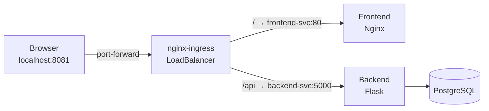

# 06 — Ingress Controller & Routing

## Goal
Set up nginx-ingress to route external traffic to services without port-forward or NodePort.

## Architecture



## Key Concepts

- **Ingress** — Routes external HTTP/HTTPS traffic to internal services
- **Ingress Class** — Which controller handles this Ingress (we use `nginx`)
- **Path-based routing** — `/` goes to frontend, `/api` goes to backend
- **LoadBalancer vs NodePort** — Ingress replaces port-forward in production
- **Rewrite annotations** — Control how paths are transformed

## Step 1: Install nginx-ingress

```bash
kubectl apply -f https://raw.githubusercontent.com/kubernetes/ingress-nginx/controller-v1.12.1/deploy/static/provider/cloud/deploy.yaml
```

Verify:
```bash
kubectl get pods -n ingress-nginx
# Expect: ingress-nginx-controller-xxx   1/1   Running
```

**RAM cost: ~62MB** — lightweight enough for a learning lab.

## Step 2: Create Ingress Rules

```yaml
apiVersion: networking.k8s.io/v1
kind: Ingress
metadata:
  name: microservice-ingress
  namespace: app
spec:
  ingressClassName: nginx
  rules:
  - http:
      paths:
      - path: /
        pathType: Prefix
        backend:
          service:
            name: frontend-svc
            port:
              number: 80
      - path: /api
        pathType: Prefix
        backend:
          service:
            name: backend-svc
            port:
              number: 5000
```

## Step 3: Test

```bash
# Port-forward the ingress controller (not the individual service!)
kubectl port-forward -n ingress-nginx svc/ingress-nginx-controller 8081:80

# Test both routes through the SAME port
curl http://localhost:8081/        # → Frontend HTML
curl http://localhost:8081/api/tasks   # → Backend JSON
```

## ⚠️ Common Pitfall: Rewrite Target

If the backend serves paths like `/api/tasks`, do NOT set `rewrite-target: /` — it strips the path prefix, breaking the route:

```yaml
# ❌ WRONG — strips /api from the URL
annotations:
  nginx.ingress.kubernetes.io/rewrite-target: /

# ✅ RIGHT — leave rewrite-target unset, paths pass through
# (no annotation needed)
```

## For Production

Replace port-forward with a real LoadBalancer:

```bash
# With MetalLB (bare metal) or cloud provider
# The LoadBalancer gets an external IP automatically
kubectl get svc -n ingress-nginx
# EXTERNAL-IP: 192.168.1.100 → real IP!
```

Then access via `http://192.168.1.100/` — no port-forward needed.

## Lessons Learned

1. **PathType: Prefix** matches everything under that path (`/api` matches `/api/tasks`, `/api/health`, etc.)
2. **Ingress replaces port-forward** — one entrypoint for all services
3. **Don't rewrite paths unnecessarily** — if your backend serves the full path, just passthrough
4. **k3d LoadBalancer stays `<pending>`** — k3d doesn't include a cloud load balancer. Use port-forward for dev
5. **Ingress handles both frontend and API** — a single port routes to multiple services based on path
